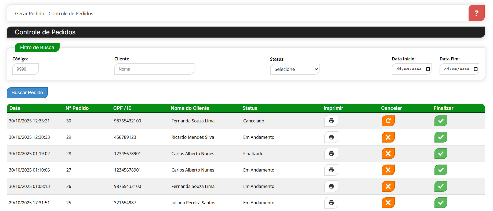

# Documentação Nano Sistema

## Documentação Completa
### Notion
https://www.notion.so/Documenta-o-Nano-Sistema-280885ef2049809aa63ff93e5b5b188c 

### Fluxo em Vídeo:
https://drive.google.com/drive/folders/1NLU6KU_Oz3wDZezNurv4oYX1-A_hIw8C?usp=sharing

## Primeiros Passos
### Pré-requisitos:

- Windows 10 ou superior

- XAMPP 7.1.15 com Apache e MySQL (Download XAMPP)

- CodeIgniter 3.1.9 com PHP 7.0.1

- JQuery 1.10.2 (referenciado no head do HTML)

### Banco de dados:

Scripts para criar e popular banco disponíveis nos arquivos:
- estrutura.txt
- popular.txt

### Regras de Negócio
Controle e organização dos pedidos, garantindo consistência entre estoque e vendas

### Funcionalidades
1. Filtros de busca por:

- Número idêntico

- Palavra-chave

- Data

### Gerar pedido:

2. Validação backend

- Atualiza estoque e registra produto vendido

- Grava forma de pagamento

- Visualizar pedido:

- Exibe todos os dados

- Esconde ID na URL

- Permite impressão e salvar em PDF

### Controle de pedidos:

- Lista pedidos com filtros

- Atualiza status (cancelado, em andamento, finalizado)

- Exibe modais dinâmicos de status (sucesso, erro, informação)

